```{r install-package, include = FALSE, eval = FALSE}
# Copy and paste the following code into your console to download and install
# the `xaringan` package that contains all of the code which allows you 
# to create presentation slides in Rmarkdown
install.packages('xaringan')
```


```{r load-packages, include = FALSE}
# Add any additional packages you need to this chunk
library(tidyverse)
library(tidymodels)
library(palmerpenguins)
library(knitr)
library(xaringanthemer)
```

```{r setup, include=FALSE}
# For better figure resolution
knitr::opts_chunk$set(fig.retina = 3, dpi = 300, fig.width = 6, fig.asp = 0.618, out.width = "80%")
```

```{r load-data, include=FALSE}
# Load your data here

```

```{r include=FALSE}

#Background image
style_xaringan(
  title_slide_background_image = "img/confetti.jpg"
)
```

class: center, middle

## Goal:Predit the price of a computer based on its configuration

---

class: inverse, center, middle

# Data pre-processing

---

# Data pre-processing
```{r pre-processing}
# PART1 >>> Data pre-processing
laptop_data_cleaned <- read_csv("laptop_data_cleaned.csv")
# Test the number of NA in data set
colSums(is.na(laptop_data_cleaned))
```
---

# Data pre-processing
```{r pre-processing-2}
# Keep the data for sum of HDD and SSD greater than 128
laptop_data_cleaned <- laptop_data_cleaned %>% 
  mutate(Storage_space = HDD+SSD)
laptop_data_cleaned <- filter(laptop_data_cleaned, Storage_space >= 128)
glimpse(laptop_data_cleaned)
```

---

class: inverse, center, middle

# Visualization

---

# Visualization
```{r 1, echo = FALSE, out.width = "80%", fig.align = "center"}
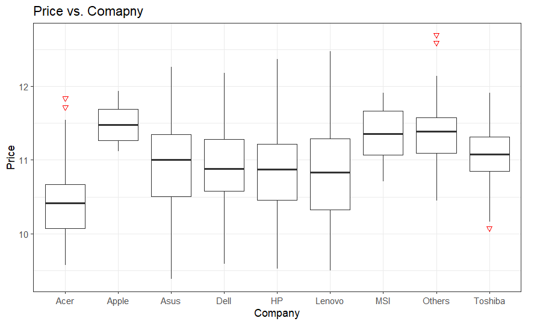
```

---

# Visualization
```{r 2, echo = FALSE, out.width = "80%", fig.align = "center"}
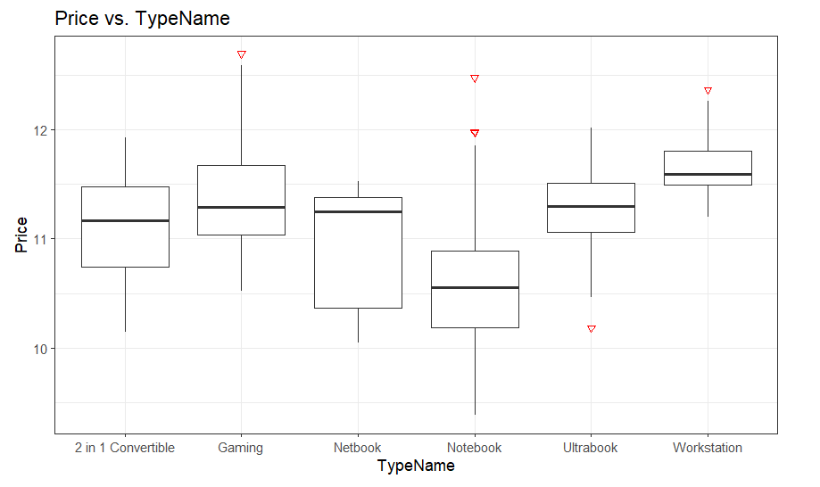
```

---

# Visualization
```{r 3, echo = FALSE, out.width = "80%", fig.align = "center"}
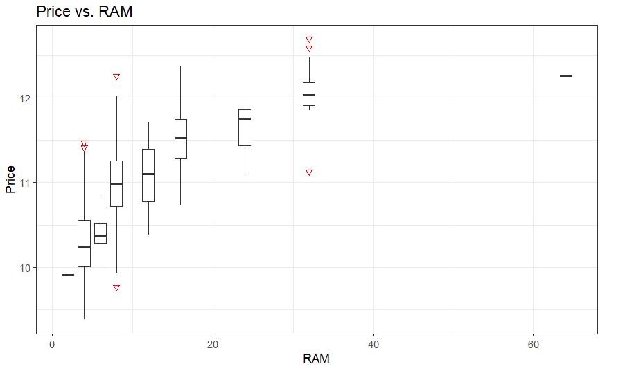
```

---

# Visualization
```{r 4, echo = FALSE, out.width = "80%", fig.align = "center"}
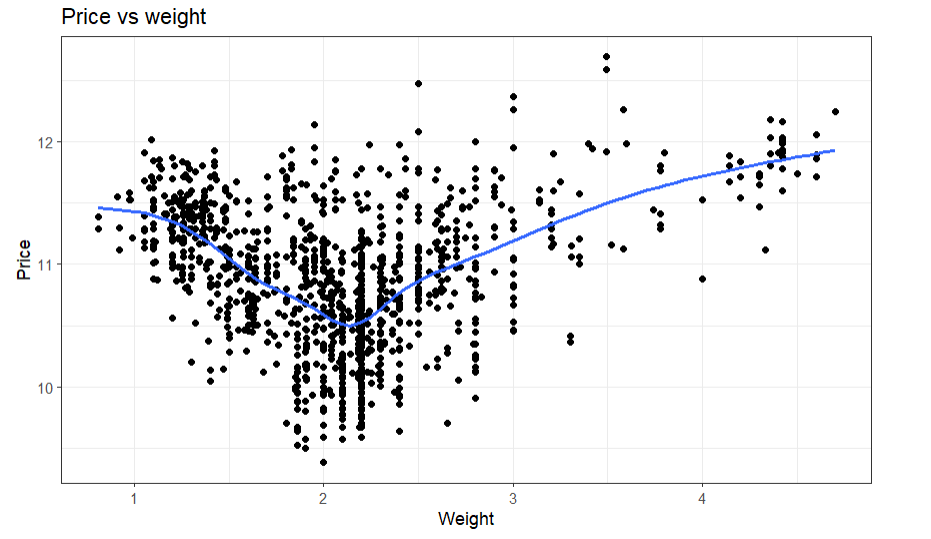
```

---

# Visualization
```{r 5, echo = FALSE, out.width = "80%", fig.align = "center"}
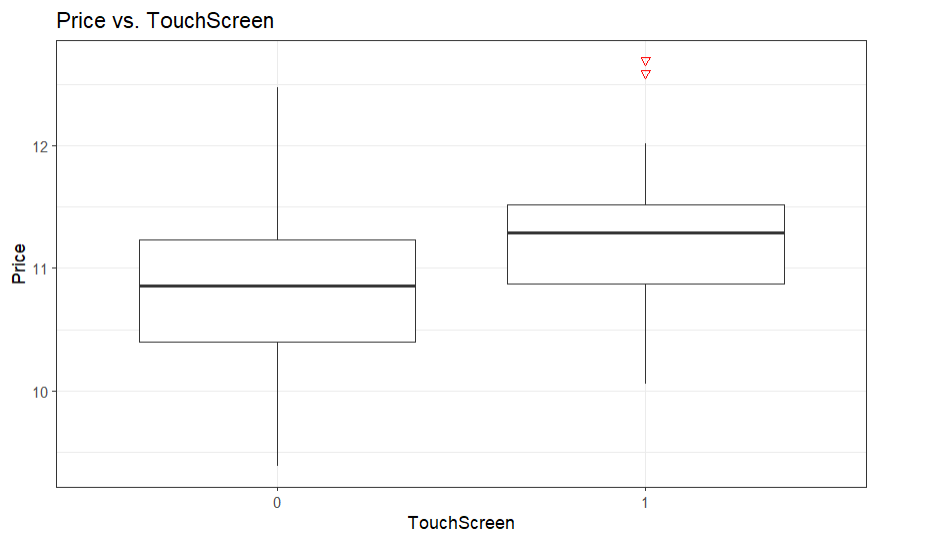
```

---

# Visualization
```{r 6, echo = FALSE, out.width = "80%", fig.align = "center"}
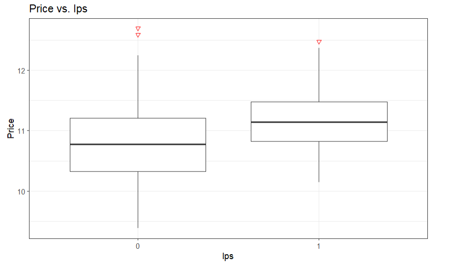
```

---

# Visualization
```{r 7, echo = FALSE, out.width = "80%", fig.align = "center"}
include_graphics("img/ppi.jpg")
```

---

# Visualization
```{r 8, echo = FALSE, out.width = "80%", fig.align = "center"}
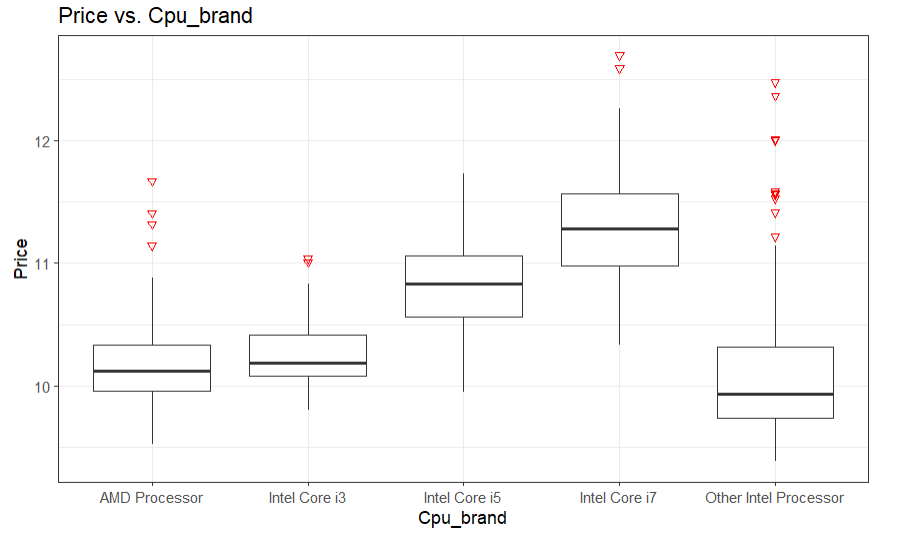
```

---

# Visualization
```{r 9, echo = FALSE, out.width = "80%", fig.align = "center"}
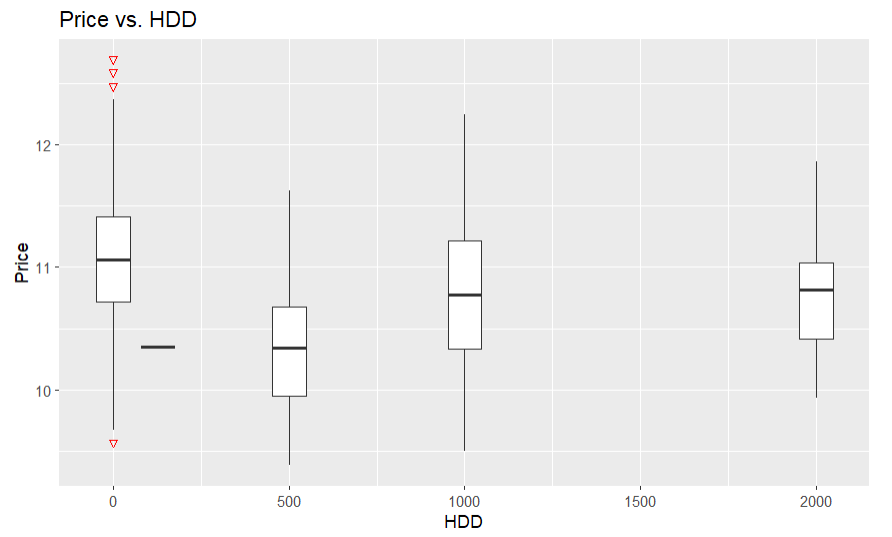
```

---

# Visualization
```{r 10, echo = FALSE, out.width = "80%", fig.align = "center"}
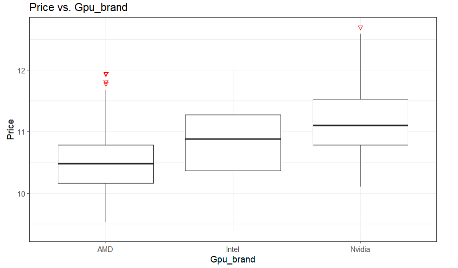
```

---

# Visualization
```{r 11, echo = FALSE, out.width = "80%", fig.align = "center"}
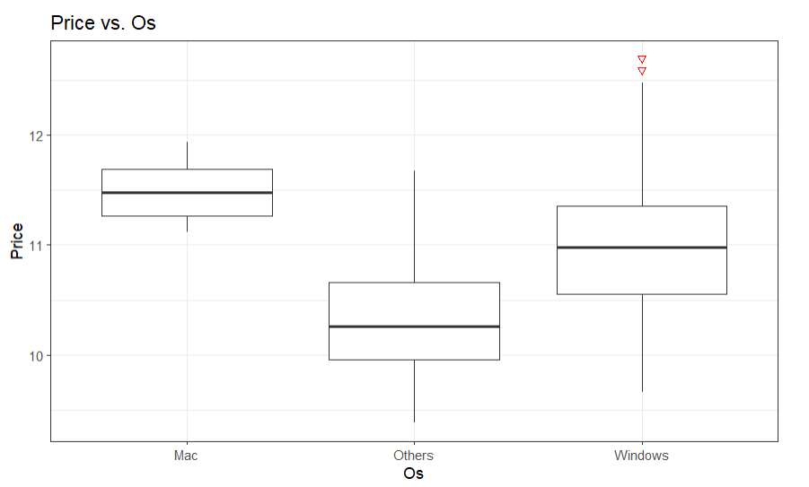
```

---

class: inverse, middle, center
# Split data set and Cross-validation

---

class: inverse, middle, center

# Model building

---

# Initial model

```{r model}
set.seed(1365)
laptop_split <- initial_split(laptop_data_cleaned, prop = 0.80)
train_data <- training(laptop_split)
laptop_fit <- linear_reg() %>%
  set_engine("lm") %>%
  fit(Price ~ . - Storage_space, data = train_data)
tidy(laptop_fit)
```

---

# Initial model graph

```{r 12, echo = FALSE, out.width = "80%", fig.align = "center"}
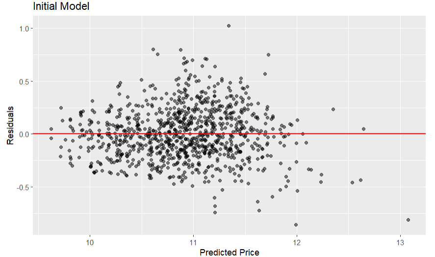
```

---

# Final model

```{r model2}
laptop_fit_final <- linear_reg() %>%
  set_engine("lm") %>%
  fit(Price ~ .-HDD -Storage_space -Ips, data = train_data)
tidy(laptop_fit_final)
```

---

# Final model graph

```{r 13, echo = FALSE, out.width = "80%", fig.align = "center"}
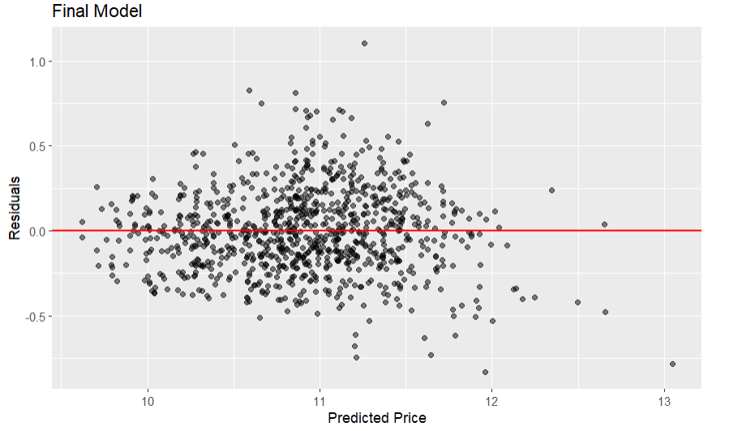
```

---
# Layouts

You can use plain text

- or bullet points

.pull-left[
or text in two columns $^*$
]
.pull-right[
- like
- this
]

.footnote[
[*] And add footnotes
]

---

# Code

```{r boring-regression}
# a boring regression
model <- lm(dist ~ speed, data = cars)
tidy(model)
glance(model)
```

---

# Plots

```{r recode-species, echo = FALSE}
# In this chunk I'm doing a bunch of analysis that I don't want to present 
# in my slides. But I need the resulting data frame for a plot I want to present.
iris_modified <- iris %>%
  mutate(Species = fct_other(Species, keep = "setosa"))
```

```{r plot-iris, echo = FALSE}
# Code hidden with echo = FALSE
# Uses modified iris dataset from previous chunk
# Play around with height and width until you're happy with the look
ggplot(data = iris_modified, mapping = aes(x = Sepal.Width, y = Sepal.Length, color = Species)) +
  geom_point() + 
  theme_minimal() # theme options: https://ggplot2.tidyverse.org/reference/ggtheme.html
```

---

## Plot and text

.pull-left[
- Some text
- goes here
]
.pull-right[
```{r warning=FALSE, out.width="100%", fig.width=4, echo=FALSE}
# see how I changed out.width and fig.width from defaults
# to make the figure bigger
ggplot(penguins, aes(x = bill_length_mm, y = species, color = species)) +
  geom_boxplot() +
  theme_minimal()
```
]

---

# Tables

If you want to generate a table, make sure it is in the HTML format (instead of Markdown or other formats), e.g.,

```{r iris-table, echo = FALSE}
kable(head(iris), format = "html")
```

---

# Images

```{r castle, echo = FALSE, out.width = "55%", fig.align = "center", fig.cap = "Image credit: Photo by Jörg Angeli on Unsplash."}
include_graphics("img/edinburgh-castle.jpg")
```

Or you can also include a full page image. See next slide.

---


class: inverse, center, middle
background-image: url(img/edinburgh-castle.jpg)
background-size: contain
---

# Math Expressions

You can write LaTeX math expressions inside a pair of dollar signs, e.g. &#36;\alpha+\beta$ renders $\alpha+\beta$. You can use the display style with double dollar signs:

```
$$\bar{X}=\frac{1}{n}\sum_{i=1}^nX_i$$
```

$$\bar{X}=\frac{1}{n}\sum_{i=1}^nX_i$$

Limitations:

1. The source code of a LaTeX math expression must be in one line, unless it is inside a pair of double dollar signs, in which case the starting `$$` must appear in the very beginning of a line, followed immediately by a non-space character, and the ending `$$` must be at the end of a line, led by a non-space character;

1. There should not be spaces after the opening `$` or before the closing `$`.

1. Math does not work on the title slide (see [#61](https://github.com/yihui/xaringan/issues/61) for a workaround).

---

# Feeling adventurous?

- Want to find out more about `xaringan`? See https://slides.yihui.name/xaringan/#1.

- You are welcome to use the default styling of the slides. In fact, that's what I expect majority of you will do. You will differentiate yourself with the content of your presentation.

- But some of you might want to play around with slide styling. The 
`xaringanthemer` provides some solutions for this that: https://pkg.garrickadenbuie.com/xaringanthemer.

- And if you want more bells and whistles, there is also `xaringanExtra`: https://pkg.garrickadenbuie.com/xaringanExtra.
