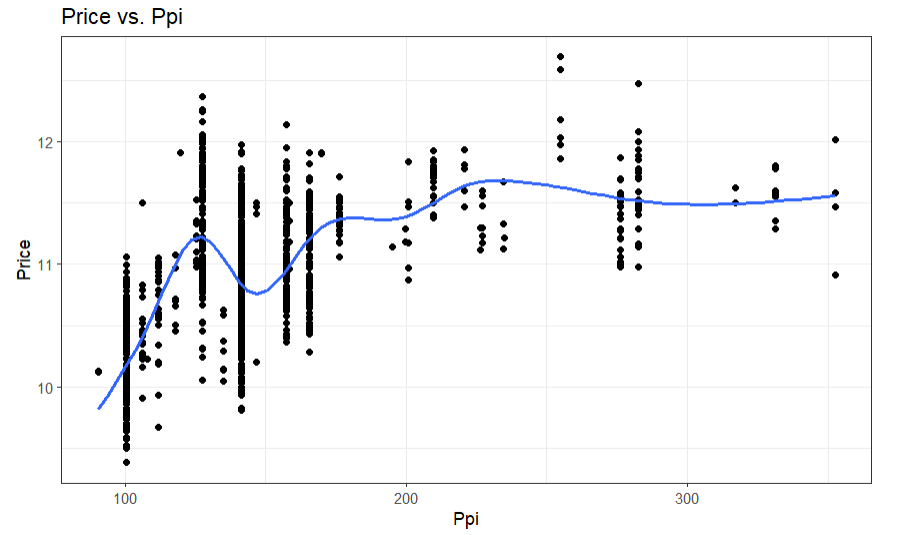

```{r install-package, include = FALSE, eval = FALSE}
# Copy and paste the following code into your console to download and install
# the `xaringan` package that contains all of the code which allows you 
# to create presentation slides in Rmarkdown
install.packages('xaringan')
```


```{r load-packages, include = FALSE}
# Add any additional packages you need to this chunk
library(tidyverse)
library(tidymodels)
library(palmerpenguins)
library(knitr)
library(xaringanthemer)
```

```{r setup, include=FALSE}
# For better figure resolution
knitr::opts_chunk$set(fig.retina = 3, dpi = 300, fig.width = 6, fig.asp = 0.618, out.width = "80%")
```

```{r load-data, include=FALSE}
# Load your data here

```

```{r include=FALSE}

#Background image
style_xaringan(
  title_slide_background_image = "img/confetti.jpg"
)
```

class: center, middle

## Goal:Predict the price of a computer based on its configuration

---

class: inverse, center, middle

# Data pre-processing

---

# Data pre-processing
```{r pre-processing/1}
# PART1 >>> Data pre-processing
```

```{r pre-processing/2, message=FALSE}
# PART1 >>> Data pre-processing
laptop_data_cleaned <- read_csv("laptop_data_cleaned.csv")
```

```{r pre-processing/3}
# Test the number of NA in data set
colSums(is.na(laptop_data_cleaned))
```


---

# Data pre-processing
```{r pre-processing-2, echo=FALSE}
# Keep the data for sum of HDD and SSD greater than 128
laptop_data_cleaned <- laptop_data_cleaned %>% 
  mutate(Storage_space = HDD+SSD)
laptop_data_cleaned <- filter(laptop_data_cleaned, Storage_space >= 128)
glimpse(laptop_data_cleaned)
```

---
# Change type of character data by factor them
```{r ?????}
laptop_data_cleaned <- laptop_data_cleaned %>% 
  mutate(Company = as.factor(Company),
         TypeName = as.factor(TypeName),
         Cpu_brand = as.factor(Cpu_brand),
         Gpu_brand = as.factor(Gpu_brand),
         Os = as.factor(Os)
         )
laptop_data_factor <- laptop_data_cleaned %>%
  mutate(Ips_factor = as.factor(Ips),
         TouchScreen_factor = as.factor(TouchScreen))
```


---

class: inverse, center, middle

# Visualization

---


# Visualization

```{r 1, echo = FALSE, out.width = "80%", fig.align = "center"}
include_graphics("img/company.jpg")
```

---

# Visualization
```{r 2, echo = FALSE, out.width = "80%", fig.align = "center"}
include_graphics("img/typename.jpg")
```

---

# Visualization
```{r 3, echo = FALSE, out.width = "80%", fig.align = "center"}
include_graphics("img/ram.jpg")
```

---

# Visualization
```{r 4, echo = FALSE, out.width = "80%", fig.align = "center"}
include_graphics("img/weight.jpg")
```

---

# Visualization
```{r 5, echo = FALSE, out.width = "80%", fig.align = "center"}
include_graphics("img/touchscreen.jpg")
```

---

# Visualization
```{r 6, echo = FALSE, out.width = "80%", fig.align = "center"}
include_graphics("img/ips.jpg")
```

---

# Visualization
```{r 7, echo = FALSE, out.width = "80%", fig.align = "center"}

```

---

# Visualization
```{r 8, echo = FALSE, out.width = "80%", fig.align = "center"}
include_graphics("img/cpu.jpg")
```

---

# Visualization
```{r 9, echo = FALSE, out.width = "80%", fig.align = "center"}
include_graphics("img/hdd.jpg")
```

---

# Visualization
```{r 10, echo = FALSE, out.width = "80%", fig.align = "center"}
include_graphics("img/gpu.jpg")
```

---

# Visualization
```{r 11, echo = FALSE, out.width = "80%", fig.align = "center"}
include_graphics("img/os.jpg")
```

---

class: inverse, middle, center
# Split data set and Cross-validation

---
# Split data sets

train set(comprising 80% )

test set(comprising 20%)

```{r ???}
set.seed(1365)

laptop_split <- initial_split(laptop_data_cleaned, prop = 0.80)

train_data <- training(laptop_split)

test_data  <- testing(laptop_split)
```

---


# Preparation of cross-validation

Before we apply cross-validation, we need to build a workflow:

```{r ????}

laptop_recipe <- recipe(Price ~ ., data = train_data) %>%
  
  step_dummy(all_nominal(), -all_outcomes()) %>%
  
  step_rm(Storage_space)

laptop_mod <- linear_reg() %>%
  
  set_engine("lm")

laptop_workflow <- workflow() %>%
  
  add_recipe(laptop_recipe) %>%
  
  add_model(laptop_mod)
```


---


# Cross-validation

Now we have everything we need.

```{r ??}
set.seed(345)

laptop_folds <- vfold_cv(train_data, v = 5)

set.seed(456)

laptop_fit_rs <- laptop_workflow %>%
  
  fit_resamples(laptop_folds)

laptop_fit_rs
```


---


# Is our model reliable?

collect_metrics(laptop_fit_rs)


summary(train_data$Price)

According to mean RSQ(0.791), it shows that 79.1% variability of the response variable (Price) can be explained by our model on train_data.
By comparing mean.RMSE(0.266) and Max.Price- Min.Price(12.691-9.135=3.556), it shows that the error of our method of predicting Price is totally acceptable(0.266/3.3556=7.93%).
```{r rmse, echo = FALSE, out.width = "55%", fig.align = "center", fig.cap = "Image credit: mean_RMSE&RSQ"}

```

```{r price, echo = FALSE, out.width = "55%", fig.align = "center", fig.cap = "Image credit: Summary Price"}

```


---


## END for cross validation
- Now, because of the good performance of our model under 5-fold cross-validation, we feel confident applying our model of predicting Price to the whole data set.


---


class: inverse, middle, center

# Model building

---

# Initial model

```{r model}
laptop_fit <- linear_reg() %>%
  set_engine("lm") %>%
  fit(Price ~ . - Storage_space, data = train_data)
tidy(laptop_fit)
```

---

#Initial model
```{r ????????}
glance(laptop_fit)$adj.r.squared
AIC(laptop_fit$fit)
```

---

# Initial model graph

```{r 12, echo = FALSE, out.width = "80%", fig.align = "center"}
include_graphics("img/initial.jpg")
```

---
# Drop HDD

```{r dropHDD}
laptop_fit_HDD <- linear_reg() %>%
  set_engine("lm") %>%
  fit(Price ~ . - Storage_space - HDD, data = train_data)
```
## R-Square test 
```{r dropHDD1}
glance(laptop_fit_HDD)$adj.r.squared
```
## AIC test
```{r dropHDD2} 
AIC(laptop_fit_HDD$fit)
```


---


# Drop Weight

```{r dropWeight}
laptop_fit_Weight <- linear_reg() %>%
  set_engine("lm") %>%
  fit(Price ~ . - Storage_space - HDD - Weight, data = train_data)
```

## R-Square test 
```{r dropWeight1}
glance(laptop_fit_Weight)$adj.r.squared 
```

## AIC test
```{r dropWeight2}
AIC(laptop_fit_Weight$fit)
```


---


# Drop Os

```{r dropOs}
laptop_fit_Os <- linear_reg() %>%
  set_engine("lm") %>%
  fit(Price ~ . - Storage_space - HDD - Os, data = train_data)
```

## R-Square test 
```{r dropOs1}
glance(laptop_fit_Os)$adj.r.squared 
```

## AIC test
```{r dropOs2}
AIC(laptop_fit_Os$fit)
```


---
# Drop Ips

```{r dropIps1}
laptop_fit_Ips <- linear_reg() %>%
  set_engine("lm") %>%
  fit(Price ~ . - Storage_space - HDD - Ips, data = train_data)
```

## R-Square test 
```{r dropIps2}
glance(laptop_fit_Ips)$adj.r.squared 
```

## AIC test
```{r dropIps3}
AIC(laptop_fit_Ips$fit)
```


---

# Final model

```{r model2}
laptop_fit_final <- linear_reg() %>%
  set_engine("lm") %>%
  fit(Price ~ .-HDD -Storage_space -Ips, data = train_data)
tidy(laptop_fit_final)
```

---

# Final model graph

```{r 13, echo = FALSE, out.width = "80%", fig.align = "center"}

```

---

# Model test

```{r 14}
test <- c(glance(laptop_fit)$adj.r.squared,
  AIC(laptop_fit$fit),
  glance(laptop_fit_final)$adj.r.squared,
  AIC(laptop_fit_final$fit))
table <- matrix(test, nrow = 2, ncol = 2,
                       dimnames = list(test = c("R-square", "AIC"), 
                                       model = c("initial", "final")))
print(table)
```

---

class: inverse, center, middle
#Testing

---

#Testing
```{r ?}
# Predict testing data
laptop_pred <- predict(laptop_fit_final, 
                       test_data) %>%
  bind_cols(test_data %>% select(Price))
laptop_pred
```

---
# Testing result
```{r ??????}
# Root Mean Square
rmse(laptop_pred, truth = Price, estimate = .pred)
# R Square 
rsq(laptop_pred, truth = Price, estimate = .pred)
```

---

class: inverse, center, middle
#Summary

---

# Problem on filter variables (AIC &R-square)
- Unexpected negative effect
- Limited improvement on model

# Future work
- Potential better choices

---

#Reference
- Kushwaha, Gyan Prakash. “Laptop Price Prediction Cleaned Dataset.” Kaggle, 15 June 2023, www.kaggle.com/datasets/gyanprakashkushwaha/laptop-price-prediction-cleaned-dataset/data. 
